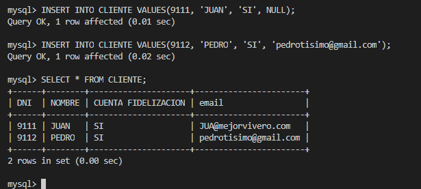

## TRIGGERS

### Ejercicio 1

```mysql
USE viveros;

DELIMITER //

CREATE PROCEDURE crear_email(IN nombre VARCHAR(45), IN dominio VARCHAR(45), OUT email VARCHAR(45))
BEGIN
    DECLARE Nomb VARCHAR(45);
    DECLARE EmailAux VARCHAR(45);
    SET @Nomb = SUBSTRING(nombre, 1, 3);
    SET @EmailAux = CONCAT(@Nomb, '@', dominio);
    SET email = @EmailAux;
END //

CREATE TRIGGER trigger_crear_email_before_insert BEFORE INSERT ON CLIENTE FOR EACH ROW
BEGIN
    IF NEW.email IS NULL THEN

        CALL crear_email(NEW.NOMBRE, 'mejorvivero.com', @emailAux);
        set NEW.email = @emailAux;
    END IF;
END //

DELIMITER ;

INSERT INTO CLIENTE
VALUES(9111, 'SI', 'JUAN', NULL);

INSERT INTO CLIENTE
VALUES(9112, 'SI', 'PEDRO', 'pedrotisimo@gmail.com');

```

Para el procedimiento de crear un email le paso como parametros el nombre, el dominio y como salida, el email. Como dentro de los triggers no se pueden usar SELECT, 
uso DECLARE y SET para asignar valores y tambien hago uso de las funciones de SUBSTRING y CONCAT para formar el nuevo email y por ultimo para devolverlo asigno
la variable auxiliar a la variable de salida.  
  
En el trigger compruebo si el valor de email es nulo, si lo es, llamo a la funcion que crea el email con el nombre que se quiere insertar en la tabla y por ultimo asigno al NEW.email el valor que devuelve la función.  
  
  
  
### Ejercicio 2
```mysql
USE catastro;
DELIMITER //

CREATE TRIGGER trigger_insert_persona_vive_en_una_unica_vivienda BEFORE INSERT ON PERSONA FOR EACH ROW
BEGIN
    IF NEW.PISO_CALLE IS NOT NULL and NEW.VIVIENDA_CALLE IS NOT NULL  THEN
        signal sqlstate '45000' set message_text = 'No puede tener dos domicilios';
    END IF;

END //

CREATE TRIGGER trigger_update_persona_vive_en_una_unica_vivienda BEFORE UPDATE ON PERSONA FOR EACH ROW
BEGIN
    IF NEW.PISO_CALLE IS NOT NULL and NEW.VIVIENDA_CALLE IS NOT NULL  THEN
        signal sqlstate '45000' set message_text = 'No puede tener dos domicilios';
    END IF;


END //


INSERT INTO PERSONA
VALUES('9111', '2001-11-00', 'JUAN', 922777777, '9111', 'RODRIGUEZ', 'AAAA', NULL,NULL,NULL,NULL,NULL);

-------
INSERT INTO PERSONA
VALUES('91112', '2001-11-00', 'JUAN', 922777777, '9111', 'RODRIGUEZ', 'AAAA', NULL,NULL,NULL,'SSS',NULL);

UPDATE PERSONA SET VIVIENDA_CALLE = 'SSS'
WHERE DNI = '9111';
------ En ambos casos da el error establecido del trigger
```
  
En este hago 2 triggers, uno para el momento de insertar y otro en caso de querer actualizar y ambos hacen lo mismo, comprueban que los valores de la direccion de la calle del piso o de la vivienda no existan a la vez porque en ese caso significaria que tiene dos domicilios.  
  
  


  
### Ejercicio 3
  
```mysql
USE viveros;
DELIMITER //

CREATE TRIGGER trigger_actualizar_stock AFTER INSERT ON PEDIDO FOR EACH ROW
BEGIN
    UPDATE PRODUCTO, PEDIDO SET PRODUCTO.STOCK = PRODUCTO.STOCK - NEW.CANTIDAD
    WHERE PRODUCTO.COD_BARRAS = NEW.ID_PRODUCTO;
END //

INSERT INTO VIVERO
VALUES(10,NULL,NULL);

INSERT INTO PRODUCTO
VALUES(311,'34',100);

INSERT INTO ZONA
VALUES(1,24,10,311);

INSERT INTO CLIENTE
VALUES(123456,'CRISTIAN','SI','C@GMAIL.COM');

INSERT INTO EMPLEADO
VALUES(999, 'DAADSDAD','AAAA','PEPE',NULL,NULL,1);

INSERT INTO PEDIDO
VALUES(50000,NULL,311,10,123456,999);
DELIMITER ;

```
  
En este trigger hago una actualización después de haber insertado en la tabla pedido, cada vez que se hace un pedido, resto a la tabla producto el stock del producto de dicho pedido.   
En el insert de la tabla PEDIDO el 100 que vemos es el stock y en el insert de la tabla PEDIDO, el 10 que vemos es la cantidad que se va a restar a 100 y como vemos en la imagen de debajo, lo ha restado bien.  
  
  
